# 观天镜 🌌

> **专业的 Nginx 配置文件拓扑分析工具** - 将 Nginx 配置转换为可视化拓扑图，清晰展示服务链路关系

[](LICENSE)
[](https://github.com/yourusername/GuanTianJing-Nginx/releases)
[](https://github.com/yourusername/GuanTianJing-Nginx)



## ✨ 功能特性

### 🎯 核心功能

- ✅ **多文件配置解析** - 支持批量上传多个 Nginx 配置文件
- ✅ **链路关系分析** - 自动识别 Nginx 之间的转发关系
- ✅ **可视化拓扑图** - 交互式 SVG 拓扑图展示
- ✅ **节点拖动** - 自由调整节点位置
- ✅ **画布缩放** - 滚轮缩放，支持 0.3x - 3x 范围
- ✅ **画布平移** - 拖动空白区域平移视图
- ✅ **路由标签** - 在连线上显示路由路径（"/api/" → "API"）
- ✅ **权重可视化** - 根据 upstream weight 显示线条粗细
- ✅ **节点详情** - 悬停显示节点详细信息
- ✅ **PNG 导出** - 导出高分辨率拓扑图
- ✅ **SVG 导出** - 导出带动画的 SVG 文件

### 🚀 新特性 (v2.0.0)

- ✨ **SVG 动画导出** - 边线流动 + 节点弹出动画
- ✨ **Tooltip 位置优化** - 显示在节点附近，自动避开边界
- ✨ **server 块解析修复** - 支持嵌套 location 块
- ✨ **静态资源路径** - 支持 root 路径识别
- ✨ **节点名称优化** - 显示 upstream 名称而非 IP

## 📋 目录

- [快速开始](#-快速开始)
- [功能特性](#-功能特性)
- [使用示例](#-使用示例)
- [配置文件示例](#-配置文件示例)
- [技术栈](#-技术栈)
- [文件结构](#-文件结构)
- [开发指南](#-开发指南)
- [贡献指南](#-贡献指南)
- [许可证](#-许可证)

## 🚀 快速开始

### 方式一：直接使用（推荐）

1. 下载 `index.html` 文件
2. 用浏览器打开
3. 上传 Nginx 配置文件
4. 查看拓扑图

### 方式二：本地运行

```bash
# 克隆仓库
git clone https://github.com/yourusername/GuanTianJing-Nginx.git
cd GuanTianJing-Nginx

# 使用任意静态服务器
npx serve .
# 或
python -m http.server 8080
# 或
npx http-server .
```

然后在浏览器中打开 `http://localhost:8080`

## 💡 使用示例

### 1. 上传配置文件

支持两种上传方式：

- **拖拽上传** - 将配置文件拖入上传区域
- **点击上传** - 点击上传区域选择文件

支持的文件格式：
- `.conf`
- `.txt`
- `.nginx`

### 2. 查看拓扑图

上传后自动解析并生成拓扑图：

```
Client
  ↓
www.123.com:80 (frontend_cluster.conf)
  ↓ frontend_cluster
frontend_cluster (192.168.1.11, 192.168.1.12)
  ↓ 192.168.1.11
192.168.1.11:80 (b.conf)
  ↓ proxy_service_c
proxy_service_c (192.168.1.20)
  ↓ 192.168.1.20
192.168.1.20:80 (c.conf)
  ↓ order_service / user_service
order_service (127.0.0.1:8080)
user_service (127.0.0.1:9090)
```

### 3. 交互操作

- **拖动节点** - 拖动节点调整位置
- **滚轮缩放** - 以鼠标位置为中心缩放
- **拖动画布** - 拖动空白区域平移
- **悬停节点** - 显示详细信息
- **一键复原** - 恢复初始视图

### 4. 导出拓扑图

- **PNG 导出** - 高分辨率图片（2x 分辨率）
- **SVG 导出** - 带动画的可编辑 SVG 文件

## 📝 配置文件示例

### 示例 1: 简单转发

```nginx
server {
    listen 80;
    server_name www.123.com;

    location / {
        proxy_pass http://192.168.1.11;
        proxy_set_header Host $host;
    }
}
```

### 示例 2: Nginx 链式转发

```nginx
server {
    listen 80;
    server_name 192.168.1.11;

    location / {
        proxy_pass http://192.168.1.12;
        proxy_set_header Host $host;
    }
}
```

### 示例 3: Upstream 服务池

```nginx
upstream backend_servers {
    server 127.0.0.1:8080 max_fails=3 fail_timeout=30s;
    server 192.168.2.123:9090;
}

server {
    listen 80;
    server_name 192.168.1.12;

    location / {
        proxy_pass http://backend_servers;
    }
}
```

### 示例 4: 复杂配置（三个文件）

**frontend_cluster.conf**
```nginx
upstream frontend_cluster {
    server 192.168.1.11:80 weight=5;
    server 192.168.1.12:80;
    keepalive 32;
}

server {
    listen 80;
    server_name www.123.com;

    location / {
        proxy_pass http://frontend_cluster;
    }
}
```

**b.conf**
```nginx
upstream proxy_service_c {
    server 192.168.1.20:80;
    keepalive 16;
}

server {
    listen 80;
    server_name 192.168.1.11;

    location /api/ {
        rewrite ^/api/(.*)$ /$1 break;
        proxy_pass http://proxy_service_c;
    }

    location /static/ {
        root /var/www/html;
    }
}
```

**c.conf**
```nginx
upstream order_service {
    server 127.0.0.1:8080 max_fails=3 fail_timeout=30s;
}

upstream user_service {
    server 127.0.0.1:9090 max_fails=3 fail_timeout=30s;
}

server {
    listen 80;
    server_name 192.168.1.20;

    location /orders {
        proxy_pass http://order_service;
    }

    location /users {
        proxy_pass http://user_service;
    }
}
```

## 🛠️ 技术栈

- **前端框架**: 纯 HTML/CSS/JavaScript
- **图表库**: SVG 原生渲染
- **样式**: CSS3 动画和过渡效果
- **字体**: JetBrains Mono + Space Grotesk
- **无依赖**: 无外部 JS 库依赖

## 📁 文件结构

```
GuanTianJing-Nginx/
├── index.html              # 主页面（包含所有功能）
├── docs/
│   ├── 需求.md             # 需求文档
│   ├── 设计.md            # 设计文档
│   ├── test_report.md     # 测试报告
│   └── 优化建议.md        # 优化建议
├── examples/
│   ├── 1/                 # 示例配置 1
│   │   ├── a.conf
│   │   ├── b.conf
│   │   └── c.conf
│   ├── 2/                 # 示例配置 2
│   │   ├── README.md
│   │   ├── backup_cluster.conf
│   │   ├── cdn_edge.conf
│   │   └── ...
│   ├── 3/                 # 示例配置 3（链路分析）
│   │   ├── b.conf
│   │   ├── c.conf
│   │   └── frontend_cluster.conf
│   └── 4/                 # 示例配置 4
│       └── a.conf
└── src/
    ├── index.html         # 源代码（镜像）
    └── index_backup_*.html # 备份文件
```

## 📚 文档

- [需求文档](docs/需求.md) - 详细的功能需求
- [设计文档](docs/设计.md) - 技术设计和架构
- [测试报告](docs/test_report.md) - 测试结果
- [优化建议](docs/优化建议.md) - 性能优化建议

## 🎯 使用场景

- 🏢 **微服务架构分析** - 清晰展示服务调用链路
- 🔄 **Nginx 配置审查** - 快速理解配置文件结构
- 📊 **系统架构可视化** - 生成架构拓扑图
- 🐛 **问题排查** - 快速定位转发问题
- 📖 **文档编写** - 生成配置说明文档

## 🤝 贡献指南

欢迎提交 Issue 和 Pull Request！

### 开发流程

1. Fork 本仓库
2. 创建特性分支 (`git checkout -b feature/AmazingFeature`)
3. 提交更改 (`git commit -m 'Add some AmazingFeature'`)
4. 推送到分支 (`git push origin feature/AmazingFeature`)
5. 提交 Pull Request

### 开发环境

```bash
# 克隆仓库
git clone https://github.com/yourusername/GuanTianJing-Nginx.git
cd GuanTianJing-Nginx

# 直接用浏览器打开 index.html 即可开发
open index.html
```

## 📄 许可证

本项目采用 [MIT 许可证](LICENSE) - 详见 LICENSE 文件

## 🙏 致谢

- 感谢所有贡献者和用户的支持
- 感谢 Nginx 官方文档提供的参考
- 感谢 [你们喜爱的老王](https://space.bilibili.com/97727630) 的灵感与支持

## 📧 联系方式

如有问题或建议，请通过以下方式联系：

- 提交 Issue: [https://github.com/ops120/GuanTianJing-Nginx/issues](https://github.com/ops120/GuanTianJing-Nginx/issues)

---

⭐ 如果这个项目对你有帮助，请给它点个 Star！
